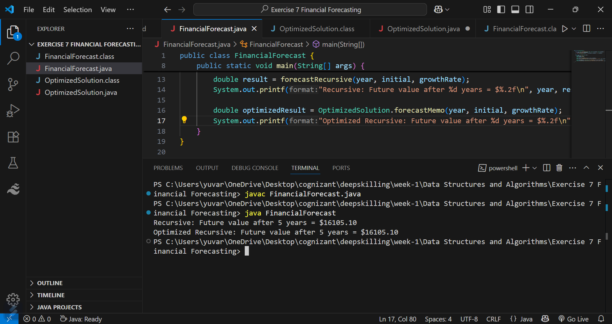

# 📈 Exercise 7: Financial Forecasting – Cognizant Nurture 4.0 (DSA)

##  1. Understand Recursive Algorithms

**Recursion** is a programming technique where a function calls itself to solve a smaller instance of the same problem.

It simplifies many real-world problems, especially those with repetitive calculations, like financial forecasting.

> **Example:**
> If `futureValue(n) = futureValue(n - 1) * (1 + growthRate)`,  
> then we can calculate the value for any year using the previous year's value.

---

## 2. Setup

To forecast future investment value, we define a recursive method:

java
public static double forecastRecursive(int year, double initialAmount, double growthRate)

## 3. Analysis

### ➤ Time Complexity:

| Approach           | Time Complexity | Space Complexity       |
| ------------------ | --------------- | ---------------------- |
| Recursive          | O(n)            | O(n) (call stack)      |
| Memoized Recursive | O(n)            | O(n) (for memoization) |

### ➤ Optimization:

- Even though both approaches are O(n), memoization improves performance by:

>Avoiding repeated calculations

>Reducing function call overhead

>Handling large inputs without stack overflow

---

## 📷 Output Screenshot

---

